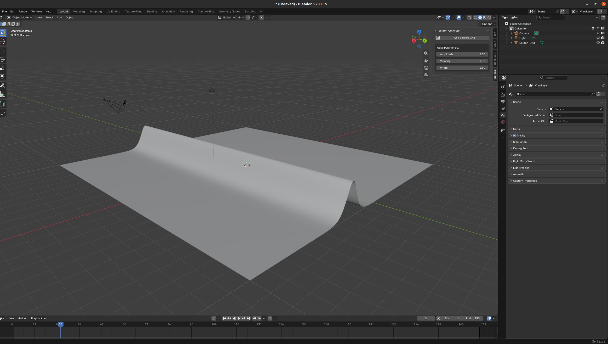

# Soliton Wave Generator

A Blender add-on that generates and animates a mathematical soliton wave (based on the [Korteweg-de Vries](https://en.wikipedia.org/wiki/Korteweg%E2%80%93De_Vries_equation) equation) on a dense mesh grid. 

## Motivation
In August 1834, Scottish engineer John Scott Russell observed a horse-drawn barge along a narrow canal (the Union Canal in Scotland). When the boat suddenly stopped, the water ahead of it formed a single, smooth wave that separated and moved forward without losing its shape or speed. Fascinated by this phenomenon, Russell chased the wave on horseback for over a mile before it disappeared from sight. He named it the "Great Wave of Translation"-a phenomenon modern science calls a soliton.

In classical fluid mechanics, waves usually dissipate over time due to dispersion. A soliton represents a unique case of perfect mathematical balance, where the dispersion effect is completely canceled out by non-linear focusing effects. This allows the soliton to travel vast distances in an unchanged form.

Why simulate solitons in 3D?
The phenomenon described over a century ago by the Korteweg-de Vries (KdV) equation is not just a mathematical curiosity, but a foundation of the modern world. Solitons appear in many fascinating areas:

- **Fiber optic telecommunications**: Optical solitons are light pulses that transmit data (like the internet) through deep-ocean cables without losing signal integrity over thousands of kilometers.

- **Extreme phenomena**: Tsunamis are effectively gigantic, destructive hydrodynamic solitons capable of crossing entire oceans without losing energy.

- **Molecular biology**: It is theorized that energy within DNA and protein chains is transferred in the form of solitons.

The goal of this add-on is to bring raw physical equations into Blender, allowing creators to interactively manipulate this "immortal" wave type in real time. This provides educational value while generating organic, smooth, and mesmerizing animations without the need to manually keyframe individual vertices.

## Features
* **Custom Mesh Generation:** One-click generation of a subdivided grid optimized for wave propagation.
* **Real-time Animation:** Automatically calculates vertex displacements on the Z-axis based on the current frame.
* **Interactive UI:** Control the wave's Amplitude, Velocity, and Width directly from the 3D Viewport sidebar.

## Installation

1. Download the `blender_soliton.py` script to your computer.
2. Open Blender (version 3.0 or later recommended).
3. Go to the top menu and select **Edit > Preferences**.
4. Switch to the **Add-ons** tab on the left.
5. Click the **Install...** button in the top right corner.
6. Navigate to the folder where you saved `blender_soliton.py`, select the file, and click **Install Add-on**.
7. In the add-ons list, search for "Soliton" and check the box next to **Add Mesh: Soliton Wave Generator** to enable it.

## How to Use

1. Open the **3D Viewport** in Blender.
2. Press `N` on your keyboard to open the Sidebar (N-Panel).
3. Click on the new **Soliton** tab on the right side of the screen.
4. Click the **Add Soliton Grid** button to spawn the base mesh (`Soliton_Grid`).
5. Press the **Spacebar** to play the timeline animation. You will see the wave start moving along the X-axis.
6. Adjust the **Amplitude**, **Velocity**, and **Width** sliders in the panel to see the wave change in real-time.

## Expected effect




## Running Unit Tests (For Developers)

The mathematical logic is separated from the Blender API to allow standalone testing. 

To run the tests outside of Blender using a standard Python environment:
```bash
python test_soliton.py
```

To run tests that require the bpy module, use Blender's headless mode:
```bash
blender --background --python test_soliton.py
```
